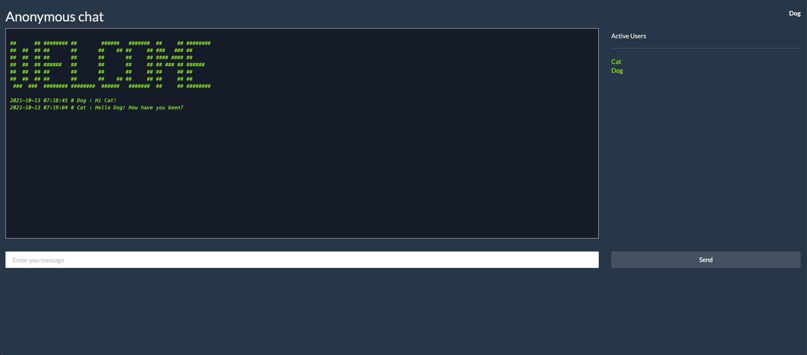

# Chatroom with R/Shiny

This is a chat application built using R/Shiny. Using this app we can create multiple user chat room with the help of shiny session.  

This also serves as an example for containerizing and running R/Shiny app.



# Getting Started

There are three different ways in which you can use this chat app:

1. [Building the image](#building-the-image)
2. [Running the docker image](#running-the-docker-image)
3. [Running the deployed app](#running-the-deployed-app)

## Building the image

Following are the steps  to be followed

1. Clone the repo and navigate to the repo folder:

```
git clone https://github.com/zatch3301/chat_room.git

cd zatch3301
```

2. Build and run:

```
docker build -t shinychat .

docker run -p 4949:4949 shinychat
```

The app will be available at [localhost port 3838](http://localhost:3838/ )

## Running the docker image

The image has already been built and pushed to DockerHub tagged zatch3301/shinychat:1.0.0 which can be pulled and run easily by executing the following code:

```
docker run -p 3838:3838 zatch3301/shinychat:1.0.0
```

## Running the deployed app

The project is also deployed on [shinyapps.io](https://www.shinyapps.io/) and can be accessed from [this link](https://zatch.shinyapps.io/chat_room/)
